<!-- DYNAMIC ANIMATED HEADER -->
<div align="center">
  
</div>

<!-- GITHUB TROPHIES (Gamified Stats) -->
<div align="center">
  <a href="[https://github.com/ryo-ma/github-profile-trophy](https://github.com/ryo-ma/github-profile-trophy)">
    
  </a>
</div>

<br>

### 💻 `~/$ whoami`

```bash
> location: "Bastok Mines"
> race: "Mithra"
> class: "Senior Developer / Multi-Hat Generalist"
> current_status: "Compiling code and pulling NMs."
```

---

### ✨ Featured Projects

<div align="center">

<!-- Row 1 -->
<a href="[https://github.com/voliathon/AltanaViewer](https://github.com/voliathon/AltanaViewer)">
  
</a>
<a href="[https://github.com/voliathon/AltanaListener](https://github.com/voliathon/AltanaListener)">
  
</a>

<br><br>

<!-- Row 2 -->
<a href="[https://github.com/voliathon/Dressup-Mod](https://github.com/voliathon/Dressup-Mod)">
  
</a>
<a href="[https://github.com/voliathon/GearInfo-Mod](https://github.com/voliathon/GearInfo-Mod)">
  
</a>

<br><br>

<!-- Row 3 -->
<a href="[https://github.com/voliathon/SheolHelper-Mod](https://github.com/voliathon/SheolHelper-Mod)">
  
</a>
<a href="[https://github.com/voliathon/SimplePull](https://github.com/voliathon/SimplePull)">
  
</a>

</div>

---

### 🛠️ Arsenal & Tooling

<div align="center">
  <!-- Core Languages -->
  
  
  
  
  
  
  
  
  <br><br>
  
  <!-- Security & AppSec -->
  
  
  
</div>

---

### 📊 Player Stats

<div align="center">
  <!-- Make sure to also update YOUR_VERCEL_URL here if you use github-stats-extended for standard stats too -->
  
  
</div>

<br>

<!-- OPTIONAL: GitHub Contribution Snake Animation -->
<!-- Note: This requires setting up the Platane/snk GitHub Action to generate the SVG -->
<div align="center">
  <picture>
    <source media="(prefers-color-scheme: dark)" srcset="[https://raw.githubusercontent.com/voliathon/voliathon/output/github-contribution-grid-snake-dark.svg](https://raw.githubusercontent.com/voliathon/voliathon/output/github-contribution-grid-snake-dark.svg)">
    <source media="(prefers-color-scheme: light)" srcset="[https://raw.githubusercontent.com/voliathon/voliathon/output/github-contribution-grid-snake.svg](https://raw.githubusercontent.com/voliathon/voliathon/output/github-contribution-grid-snake.svg)">
    
  </picture>
</div>
